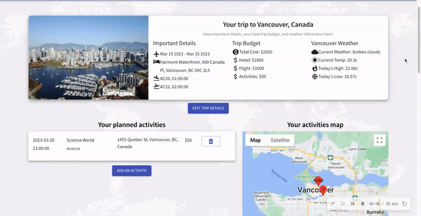
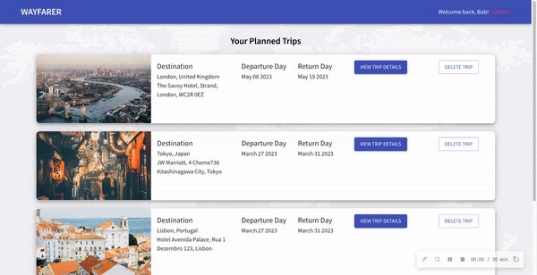
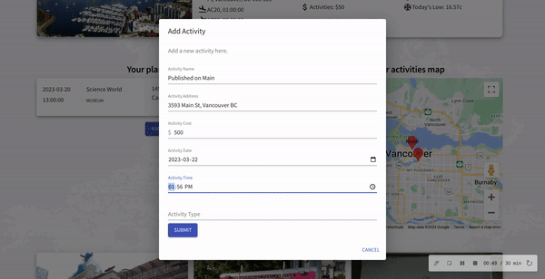
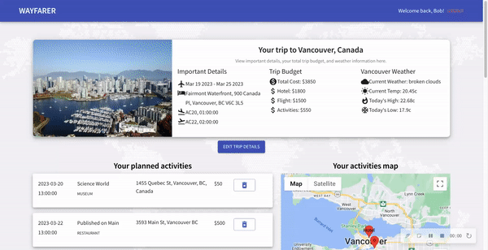

# Wayfarer

A Travel App for the Modern Wayfarer.

All of your trip information in one place - so you can focus on the destination, not the details.

Create and view all of your trips, keep track of your trip activities and budget, view recommendations for where to visit during your stay, and your trip hotel and activities on a map.

## Login and View All Trips


## View Single Trip Information


## Edit Trip Information



## Add Trip


## Delete Trip



## Add Activity



## Delete Activity



## Setup

In one terminal,

```sh
cd trip-api
```

and then

```sh
npm install
```

In the other terminal,

```sh
cd trip
```

and then

```sh
npm install
```

## Launch the server

```sh
cd trip-api
```

and then

```sh
npm start
```

## Running the app

```sh
cd trip
```

and then

```sh
npm start
```

## Dependencies

- Axios
- React
- PSQL
- Express
- Node 5.10.x or above
